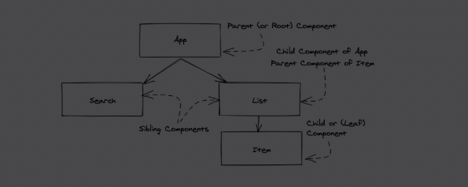

# Create main components

1. Необхідно створити 2 основні компоненти **SearchForm** і **List** та помістити їх в App.
    - Search:
   ```
   <form>
    <label htmlFor="search">Search: </label> 
    <input id="search" type="text" />
    <button type="submit">Submit</button>
   </form>
   ```
    - List (повинна приймати в себе список stories і рендерити його):
    ```
   <li>
         <span style={{ width: '40%' }}>
            <a href={url}>title</a>
         </span>
         <span style={{ width: '30%' }}>author</span>
         <span style={{ width: '10%' }}>comments</span>
         <span style={{ width: '10%' }}>points</span>
         <span style={{ width: '10%' }}>
          <button type="button">
            Dismiss
          </button>
         </span>
   </li>
   ```
2. Виокремити компоненту Item, яка буде наповнювати вміст компоненти List. В результаті має вийти наступна структура:

